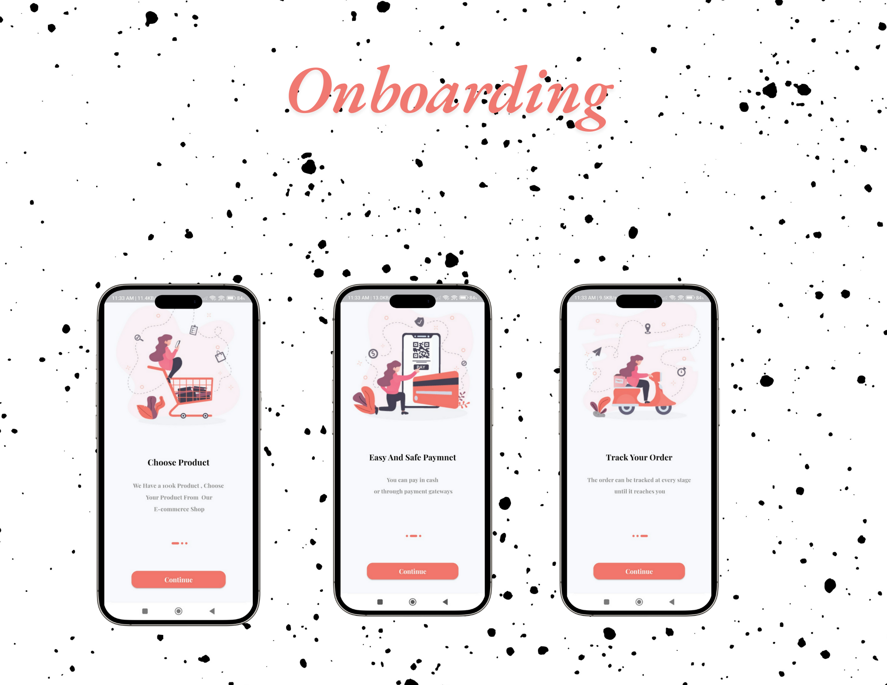
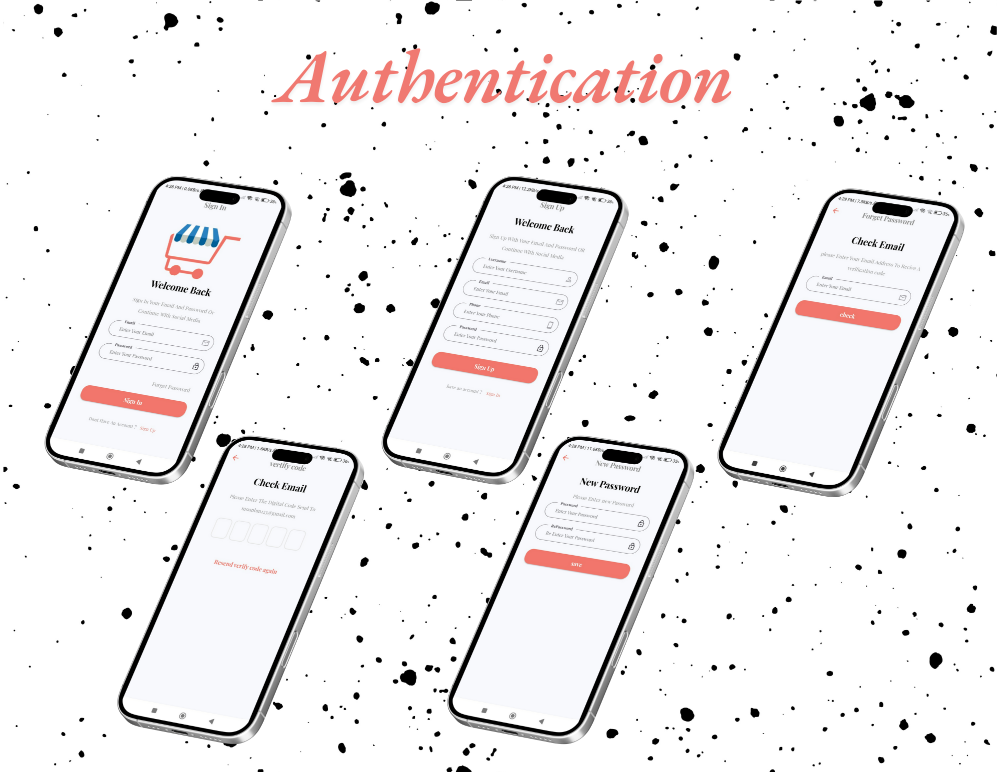
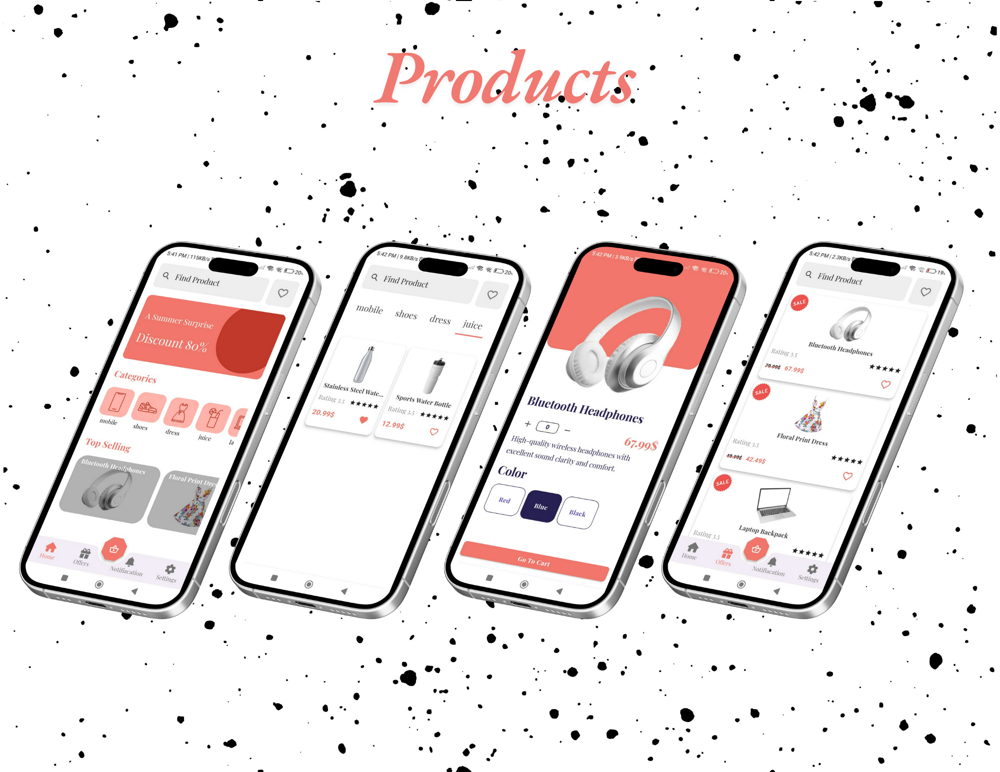
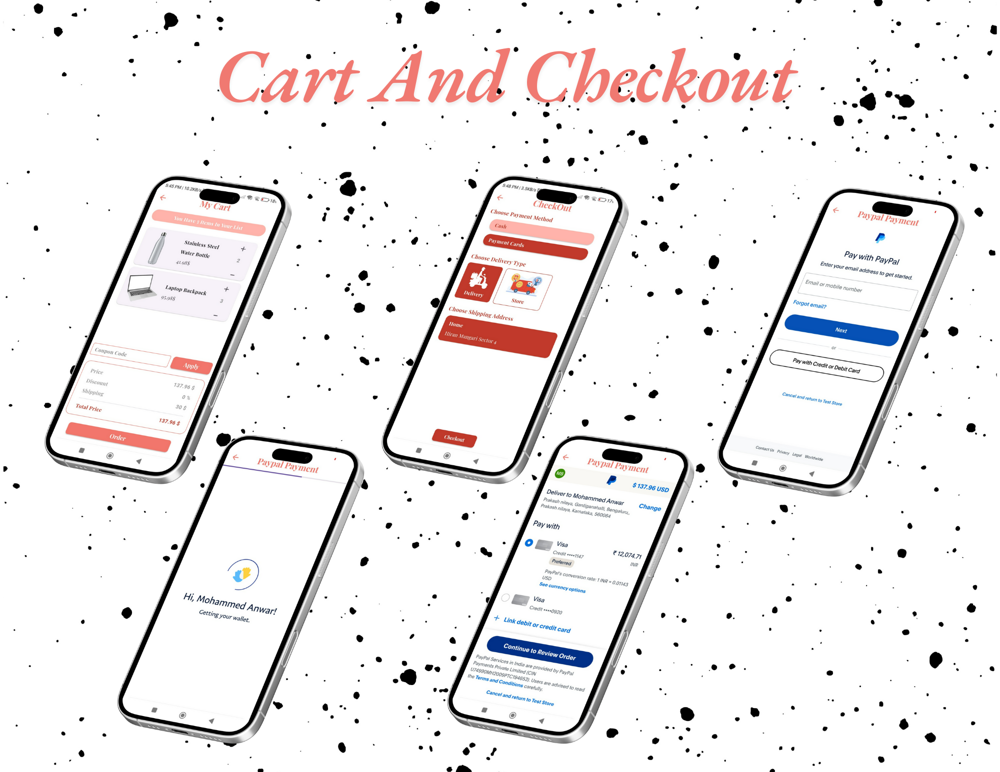
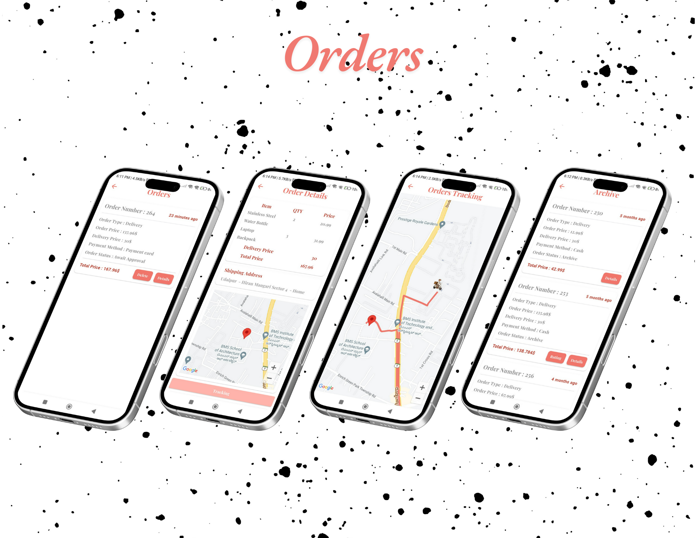
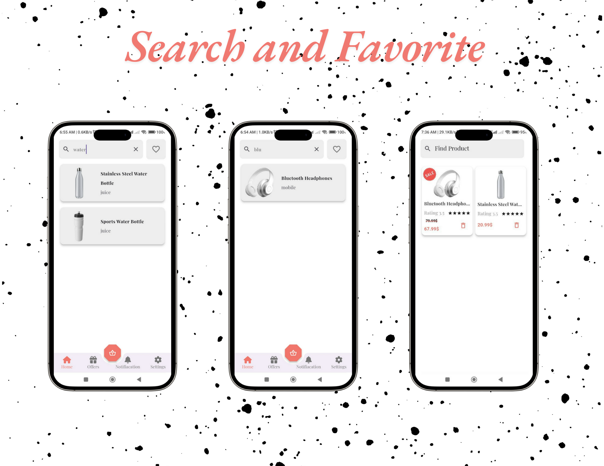

## **Ecommerce App** 🛒🌐

Welcome to **Ecommerce App**! 🌟🛍️ This app is here to revolutionize your shopping experience with a vast selection of electronic products, all at your fingertips! With its sleek design, powerful features, and an intuitive user interface, **Ecommerce App** guarantees a fun, fast, and seamless shopping journey for everyone! ✨🚀

Whether you’re looking for the latest gadgets, home electronics, or accessories, we have it all! 🌟 From easy navigation to secure payments, everything is designed to make your shopping experience super smooth! 💻📱

---

## **🌟 Features 🌟**

### 1. **Onboarding Experience 🎉🖥️**

Start your journey with **Ecommerce App** with an engaging and informative onboarding experience! 🎈📝 Our onboarding screens will guide you through the app, highlighting key features and setting you up for a smooth start.

- **Welcome Screen:** A friendly and warm introduction to **Ecommerce App** 🏠🎉  
- **Feature Highlights:** Learn about the top features, such as easy navigation, secure payments, exclusive offers, and more! 🏷️💳  
- **Easy Navigation:** Get oriented with the app’s simple, user-friendly interface! 🎮📱  

---

### 2. **User Authentication 🔐🔑**

Logging in, registering, and resetting your password has never been easier or more secure! 🛡️ With **Ecommerce App**, we ensure your personal information is protected with advanced security protocols. 🏦🔒

- **Login:** Access your account easily using your credentials! 👨‍💻👩‍💻  
- **Register:** Set up your account with just a few simple steps! ✍️📲  
- **Forgot Password:** Reset your password quickly and securely! 🔑🧑‍💻  

---

### 3. **Product Listing with Details Integration 🛍️📝**

ShopEase brings you an intuitive product listing experience combined with in-depth details to ensure your shopping journey is smooth and informative! 🎯🛒

---

### **Browse Products Effortlessly 📱🔍**

Discover a wide range of electronics organized into categories and subcategories for easy browsing! 🚀💻 Use advanced filters to narrow your search and find exactly what you're looking for.

- **Categories:** Easily browse through products grouped by categories, like smartphones, laptops, TVs, accessories, and more! 📲💻📺  
- **Filters:** Refine your search with options such as price range, brand, ratings, and more! 💸⭐  
- **Search:** Quickly locate products by typing in names, keywords, or product IDs! ⌨️🔎  

---

### **Detailed Product Information 📖**

Click on any product to access detailed information, ensuring you make an informed buying decision! 💡✅

#### **Features of the Product Details Page:**

- **High-Quality Images:** Swipe through multiple angles to get a full view of the product! 📸👀  
- **Comprehensive Descriptions:** Read all the important details, such as features, specs, and usage info! 📑📝  
- **Pricing Information:** See the current price, any discounts, and special offers at a glance! 💰💸  
- **User Reviews:** Check out real feedback from customers to help you make the right choice! ⭐💬  

---

### **Seamless Navigation Between Listing and Details 🔄**

With **Ecommerce App**, you can easily switch between browsing products and viewing detailed information!

- **From Listing to Details:** Simply tap on a product in the list to instantly see more details! 📱🛍️  
- **Back to Listing:** Return to your previous search or category without losing your place! 🔙  

This smooth integration ensures that your shopping experience is efficient, fast, and enjoyable! 🌟💡

---

### 4. **Add to Cart & Checkout Process 🛒💳**

Adding products to your cart and completing checkout has never been easier! 🛍️💨 The cart updates in real-time to show you the total price, quantity, and more.

- **Cart Features:** View all your items, update quantities, or remove products as needed! 🧾🛒  
- **Shipping Address:** Add or select your delivery address with just a few taps! 🏠🚚  
- **Payment Options:** Choose from a variety of payment methods, including PayPal! 💳  

---

### **5. Order History, Tracking & Status 📦📍**

View and manage your past orders, including **pending orders**, **archived orders**, and track the real-time status of your delivery via Google Maps! 🚚📍

- **Pending Orders:** See orders that are still being processed. ⏳🛒  
- **Archived Orders:** Access orders that have been completed or archived. 📅🗃️  
- **Track Orders:** Follow your delivery’s journey in real-time on Google Maps, so you know exactly where your order is at all times! 📍🗺️

---

### **6. Search & Favorite 🔍❤️**

Find your favorite products in seconds and save them for future reference! 📌💖 With **Ecommerce App**, searching and favoriting products has never been easier or more fun!

- **Search:** Quickly locate products by typing in names, categories, or keywords! 🔍👨‍💻  
- **Filters:** Narrow down your search using filters such as price, brand, rating, etc.! 📊  
- **Favorite Products:** Easily save your favorite items to come back to them later! 💖📝  

---

### **7. User Profile Page 👤**

Your profile is where you can manage your account settings and view your past orders. Customize your preferences and keep track of everything with ease! 🖥️🔧  
The profile page also includes important sections for managing your account, tracking orders, and more.

- **Settings:** Update your personal details and preferences! ⚙️  
- **Order History:** Access and view all your past orders! 🛍️🔍  
- **Address:** Manage and update your delivery addresses for a smooth checkout process. 📍  
- **Pending Orders:** View orders that are still being processed and are yet to be completed. ⏳  
- **Archived Orders:** Check orders that have been completed or archived for your reference. 📅🗃️  
- **About Us:** Learn more about our company, mission, and values. 🌟  
- **Contact Us:** Reach out to us for inquiries, feedback, or support. 📬  
- **Logout:** Log out of your account when you're done shopping! 🚪

---

## **📬 Contact Us 📬**

If you have any questions or need assistance, or if you'd like to discuss suggestions or improvements, feel free to reach out to us! We are here to help! 🤗💬

- **Email:** moanbm123@gmail.com 📧  
- **LinkedIn:** [@Mohammed Anwar](https://www.linkedin.com/in/mohammad-anwar-bin-muslim-50102725b/) 🐦  
- **WhatsApp:** [Contact us on WhatsApp](https://wa.me/+917411440342) 📱  

---

### **🌟 Thank you for visiting! 🌟**

We look forward to your feedback and suggestions to continue improving your shopping experience with **Ecommerce App**! ✨💬
